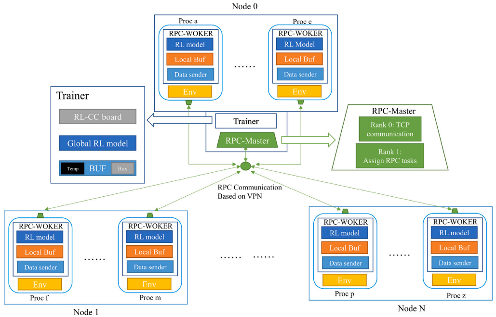

# DistRLCC: A Novel Distributed Reinforcement Learning Training System for Network Congestion Control

**DistRLCC** 是一个基于强化学习的拥塞控制（Congestion Control, CC）模型的 **多机分布式训练系统**。
该项目实现了一个基于 **PyTorch RPC + Python3 环境** 的 [Indigo 模型](https://www.usenix.org/conference/atc18/presentation/yan-francis) 的分布式训练系统（[原始实现](https://github.com/StanfordSNR/indigo)是基于Python 2.7 + tensorflow）。

<!--  -->


<!-- --- -->

## 环境要求

- 操作系统：**Ubuntu 18.04 或以上**
- Python 3.7：  
- 依赖：
  - [mahimahi](https://github.com/ravinet/mahimahi)  
  - Python 包依赖（后续会提供 `requirements.txt`）

安装方式示例：

```bash
sudo apt update
sudo apt install mahimahi -y

# 推荐使用虚拟环境
conda create -n DistRLCC python=3.7.9 -y
conda activate DistRLCC

# 安装依赖
pip install -r requirements.txt
```

<!-- --- -->


## 运行方法

### 运行前准备

重启后需要首先执行以下命令，启用 IP 转发（mahimahi仿真需要）：

```bash
sudo sysctl -w net.ipv4.ip_forward=1
```


### 启动方式总览

* **所有机器**都用**同一套代码与参数格式**启动；差异只在两个参数：

  * `--node-num`：**集群总机器数**（所有机器填相同的值）。
  * `--node-index`：**当前机器的索引**（主机为 `0`，其它机器依次为 `1,2,3,...`）。
* **所有机器**的 `--IP` / `--port` 都要指向**主节点（node 0）** 的 IP/端口。
* 训练时的**总进程数**由代码中的 `NODES` 决定（见下文），主节点会起 `2 + len(NODES[0])` 个进程，其余分节点各起 `len(NODES[i])` 个进程。
* `--gpu -1` 可仅用 CPU；`--tun` 适用于 OpenVPN/Tailscale 等 VPN 场景；`--load` # 继续训练/加载已有模型
<!-- --- -->

### 模板命令

> 把 `X` 换成你的参数：`NODE_NUM`=总机器数；`NODE_INDEX`=当前机器索引；`MASTER_IP`=主机 IP；`PORT` 默认为 29513

```bash
python main_mach_test_load.py \
  --gpu 0 \
  --node-index NODE_INDEX \
  --node-num NODE_NUM \
  --IP MASTER_IP \
  --port 29513
# 可选： --load  --tun
```

<!-- --- -->

### 示例：2 台机器（node 0 为主，node 1 为从）

#### 主节点（node 0）

```bash
python main_mach_test_load.py \
  --gpu 0 \
  --node-index 0 \
  --node-num 2 \
  --IP 192.168.0.104 \
  --port 29513
```

#### 分节点（node 1）

```bash
python main_mach_test_load.py \
  --gpu 0 \
  --node-index 1 \
  --node-num 2 \
  --IP 192.168.0.104 \
  --port 29513
```

<!-- --- -->

### 示例：3 台机器（node 0/1/2）

> 三台都把 `--node-num` 设为 `3`，`--IP` 都写主机 IP（例如 `192.168.0.104`）

* 主节点（node 0）

```bash
python main_mach_test_load.py --gpu 0 --node-index 0 --node-num 3 --IP 192.168.0.104 --port 29513
```

* 分节点（node 1）

```bash
python main_mach_test_load.py --gpu 0 --node-index 1 --node-num 3 --IP 192.168.0.104 --port 29513
```

* 分节点（node 2）

```bash
python main_mach_test_load.py --gpu 0 --node-index 2 --node-num 3 --IP 192.168.0.104 --port 29513
```

<!-- --- -->

### 示例：4 台机器（node 0/1/2/3）

> 四台都把 `--node-num` 设为 `4`，`--IP` 都写主机 IP

* 主节点（node 0）

```bash
python main_mach_test_load.py --gpu 0 --node-index 0 --node-num 4 --IP 192.168.0.104 --port 29513
```

* 分节点（node 1）

```bash
python main_mach_test_load.py --gpu 0 --node-index 1 --node-num 4 --IP 192.168.0.104 --port 29513
```

* 分节点（node 2）

```bash
python main_mach_test_load.py --gpu 0 --node-index 2 --node-num 4 --IP 192.168.0.104 --port 29513
```

* 分节点（node 3）

```bash
python main_mach_test_load.py --gpu 0 --node-index 3 --node-num 4 --IP 192.168.0.104 --port 29513
```

<!-- --- -->

### `NODES` 配置要点（**非常重要**）

`NODES` 决定每台机器要起多少**环境进程**。它是一个“按机器分组”的列表：

* `NODES[0]`：主机上的环境 ID 列表（长度 = 主机环境进程数）
* `NODES[1]`：分节点 1 上的环境 ID 列表
* `NODES[2]`：分节点 2 上的环境 ID 列表
* …

> 伪例（请按你的环境实际 ID/数量填写）：

```python
# a2c_ppo_acktr/config.py
NODES = [
  [0, 1, 2, 3],      # node 0（主机）有 4 个 env
  [4, 5, 6],         # node 1 有 3 个 env
  [7, 8],            # node 2 有 2 个 env
  [9, 10, 11, 12],   # node 3 有 4 个 env
]
```

* 主节点总进程数 = `2 + len(NODES[0])`（其中 `2` 是 TCP Server + Trainer）
* 分节点 i 总进程数 = `len(NODES[i])`
* **总 world\_size** = `sum(len(NODES[i]) for i in nodes) + 2`（代码里已计算：`args.world_size = len(args.env_list) + 2`）
* 如你增加/减少机器数，一定要同步：

  1. 启动时的 `--node-num`；
  2. 每台机器的 `--node-index`；
  3. `NODES` 列表长度与分配。

<!-- --- -->

## 常见问题 
* **多主机分布式训练**需要保证主机之间的网络连通性：  
  - **方式一**：在同一局域网内；  
  - **方式二**：在 VPN 环境下（如 [OpenVPN](https://openvpn.net/) 或 [Tailscale](https://tailscale.com/)）。  
* **机器不在同一局域网**：建议用 Tailscale/OpenVPN，并在各机上都用 **主机的 Tailscale/VPN IP** 作为 `--IP`，可能需要额外在代码中手动设定一下调用TUN网卡。
* **端口与防火墙**：确保主节点 `--port` 对所有分节点可达（不仅是主端口，训练过程中还会有 RPC/数据流量）。
* **IP 转发**：重启后先执行
  ```bash
  sudo sysctl -w net.ipv4.ip_forward=1
  ```
* **GPU/CPU 混用**：每台机器可独立设定 `--gpu`，但建议同构以减少调试复杂度。

<!-- --- -->


<!-- --- -->

<!-- ## 注意事项 -->


<!-- --- -->

## 论文

详细内容请参考以下论文：

```bibtex
@article{luo2023novel,
  title={A novel Congestion Control algorithm based on inverse reinforcement learning with parallel training},
  author={Luo, Pengcheng and Liu, Yuan and Wang, Zekun and Chu, Jian and Yang, Genke},
  journal={Computer Networks},
  volume={237},
  pages={110071},
  year={2023},
  publisher={Elsevier}
}
```
